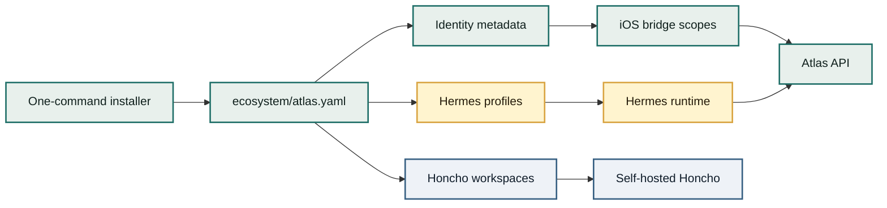

# Project Atlas Documentation

Project Atlas is a private deployment and customization layer around Hermes. It helps a family or trusted group define who exists, which Hermes profiles exist, which people can use each profile, which Honcho workspace each profile uses, and which custom bridge/data surfaces are available.

Hermes stays the agent runtime. Atlas should not become a chat proxy, model router, persona framework, or memory engine.

<div class="atlas-grid">

**Hermes native first**
Messaging, profiles, gateway auth, native skills, MCP discovery, model/provider auth, and memory-provider behavior belong to Hermes.

**Atlas fills gaps**
Atlas provides installer workflows, identity metadata, iOS bridge APIs, structured facts, approvals, and generated Hermes profile customizations.

**Private by default**
Administrative surfaces stay on the VPS or Tailscale. Only Hermes' signed WhatsApp webhook path is published through Tailscale Funnel.

</div>

## What Atlas Builds



## Main Paths

| Path | Start Here |
| --- | --- |
| Install on a VPS | [Getting Started](getting-started.md) |
| Understand the system | [Architecture](architecture.md) |
| Operate services | [Operations](operations.md) |
| Configure WhatsApp | [WhatsApp](whatsapp.md) |
| Build the iOS bridge | [iOS Bridge](ios-bridge.md) |
| Review data boundaries | [Security Model](security.md) |

## Repository Shape

The repo keeps product documentation in `docs/` and implementation files in focused folders:

```text
apps/atlas-api/          Atlas API, bridge routes, MCP endpoint, seed/migrate tools
ecosystem/               Example self-serve ecosystem configuration
infrastructure/          Database migrations and host-specific infrastructure assets
scripts/                 Installer, CLI wrapper, Tailscale, Honcho, profile generation
docs/                    GitHub Pages documentation site
```

See [Repository Structure](reference/repository-structure.md) for the full map.
