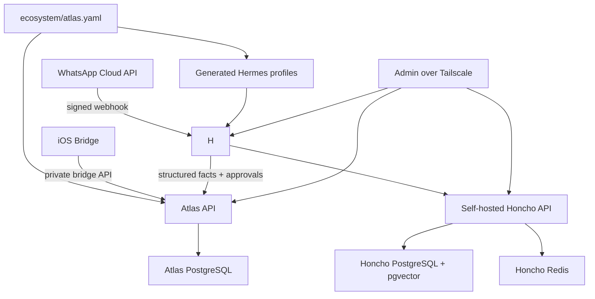

# Architecture

Project Atlas separates the ecosystem from the agent runtime. The ecosystem is installer-defined through `ecosystem/atlas.yaml`; there are no hard-coded household members or built-in personal agents.

Atlas owns:

- Persistent user and agent identities.
- Identity metadata and generated Hermes gateway allowlist values.
- Built-in skill catalog and generated skill manifests.
- Structured facts in PostgreSQL.
- Honcho workspace names in generated Hermes profile config.
- Approval workflows.
- Integration ingress and egress.
- Audit logs.

Hermes owns:

- The runtime conversation loop.
- Tool execution inside its configured sandbox.
- Agent profile behavior.
- Native memory-provider activation and Honcho memory access.

Honcho owns:

- Long-term memory inside isolated workspaces.

## Initial Topology

## WhatsApp Rules

- Allowed WhatsApp numbers are defined in `ecosystem/atlas.yaml`.
- Atlas generates Hermes' `WHATSAPP_ALLOWED_USERS` and `WHATSAPP_CLOUD_ALLOWED_USERS` values in `data/hermes/atlas.env`.
- Hermes' WhatsApp gateway rejects unknown senders before the agent loop.
- Atlas still stores identity records for bridge scoping, structured facts, approvals, and audit trails.

## Structured Data Versus Memory

PostgreSQL is the source of truth for facts:

- Identity records
- Health summaries
- Nutrition intake summaries
- Training plans, planned workouts, performed workouts, exercises, and sets
- Calendar busy blocks
- Reminders
- Goals
- Approvals
- Audit logs

Honcho is the memory layer for conversational and preference memory. Atlas generates Hermes profile-local `honcho.json` files with the intended workspace ids, and Hermes uses its native Honcho memory provider to read and write memory. Atlas does not merge workspaces automatically.

## Skills

Skills are configured per agent in `ecosystem/atlas.yaml`. Atlas validates skill ids, stores a manifest in the agent config, appends a minimal data-capability map to generated Hermes `SOUL.md` files, and writes a profile-local `skills.json`.

Skills are not a prompt-only security mechanism or persona system. Hermes remains the reasoning runtime; Atlas provides scoped facts, bridge context, generated memory-provider config, and approval boundaries. WhatsApp identity is enforced by Hermes gateway allowlists; bridge data scoping and approvals remain enforced by Atlas API and the iOS bridge.
