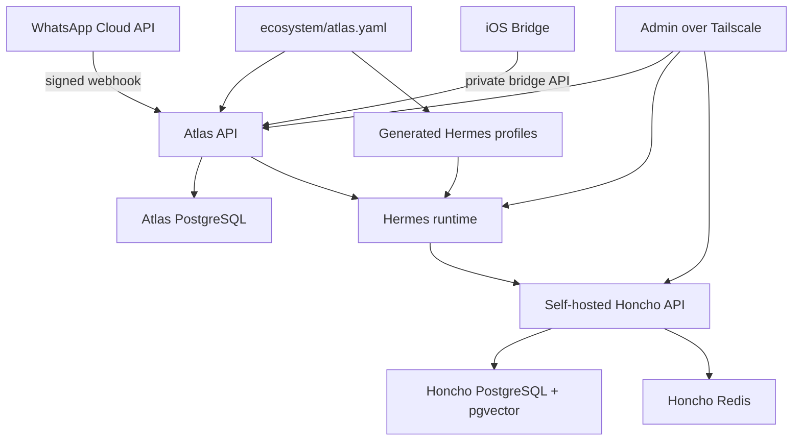

# Architecture

Project Atlas separates the ecosystem from the agent runtime. The ecosystem is installer-defined through `ecosystem/atlas.yaml`; there are no hard-coded household members or built-in personal agents.

Atlas owns:

- Persistent user and agent identities.
- Channel allowlists and permissions.
- Structured facts in PostgreSQL.
- Memory workspace boundaries.
- Approval workflows.
- Integration ingress and egress.
- Audit logs.

Hermes owns:

- The runtime conversation loop.
- Tool execution inside its configured sandbox.
- Agent profile behavior.

Honcho owns:

- Long-term memory inside isolated workspaces.

## Initial Topology

## Routing Rules

- Each allowlisted WhatsApp number maps to the default agent defined for that identity.
- Shared-agent aliases such as `family:` or `/household` are defined in `ecosystem/atlas.yaml`.
- A shared-agent alias only routes if the sender is a member of that agent.
- Unknown WhatsApp senders are rejected and audited.

## Structured Data Versus Memory

PostgreSQL is the source of truth for facts:

- Identity records
- Health summaries
- Nutrition intake summaries
- Calendar busy blocks
- Reminders
- Goals
- Approvals
- Audit logs

Honcho is the memory layer for conversational and preference memory. Atlas keeps Honcho workspace ids but does not merge workspaces automatically.
