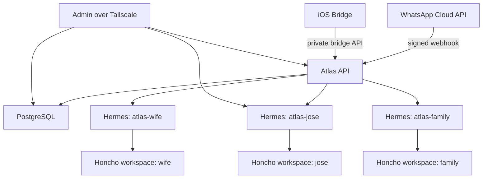

# Architecture

Project Atlas separates the ecosystem from the agent runtime.

Atlas owns:

- Persistent user and agent identities.
- Channel allowlists and permissions.
- Structured facts in PostgreSQL.
- Memory workspace boundaries.
- Approval workflows.
- Integration ingress and egress.
- Audit logs.

Hermes owns:

- The runtime conversation loop.
- Tool execution inside its configured sandbox.
- Agent profile behavior.

Honcho owns:

- Long-term memory inside isolated workspaces.

## Initial Topology

## Routing Rules

- Jose's allowlisted WhatsApp number routes to `atlas-jose`.
- Wife's allowlisted WhatsApp number routes to `atlas-wife`.
- A family-prefixed message such as `family: plan dinner` routes to `atlas-family` only if the sender is a member of the family agent.
- Unknown WhatsApp senders are rejected and audited.

## Structured Data Versus Memory

PostgreSQL is the source of truth for facts:

- Identity records
- Health summaries
- Calendar busy blocks
- Reminders
- Goals
- Approvals
- Audit logs

Honcho is the memory layer for conversational and preference memory. Atlas keeps Honcho workspace ids but does not merge workspaces automatically.
