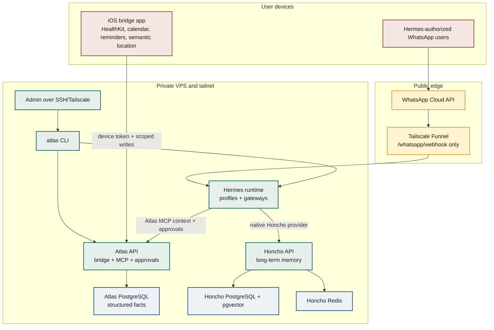
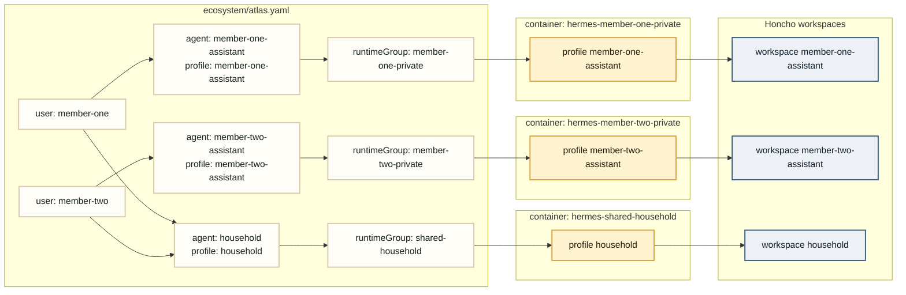
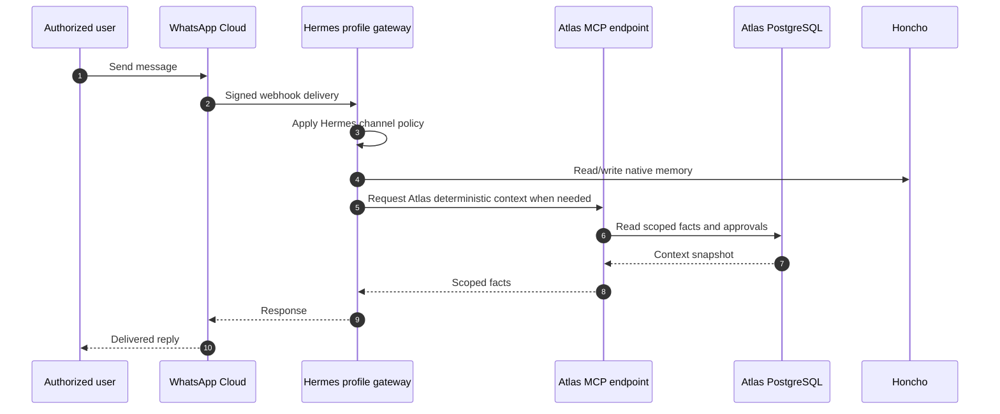
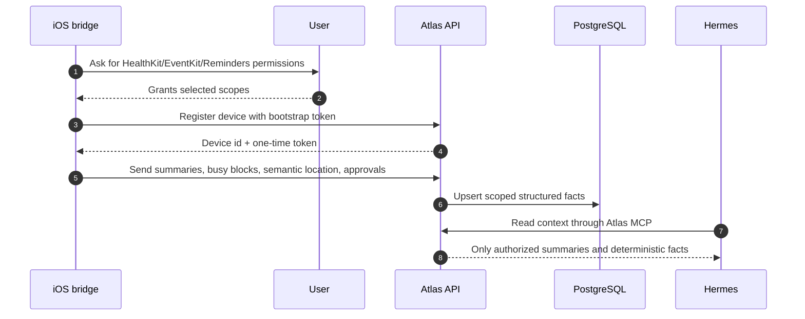
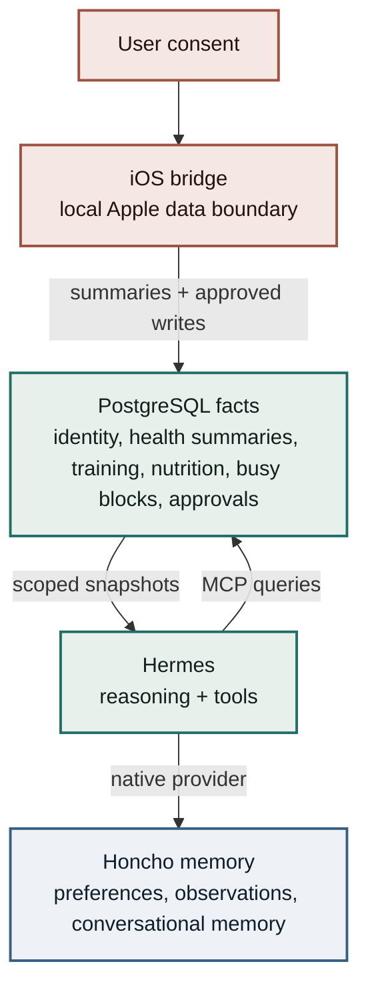

# Architecture

Atlas separates the installer's deterministic control plane from Hermes' runtime. The system is intentionally small: Atlas defines users, profile membership, bridge permissions, deterministic facts, approvals, and generated config; Hermes owns conversation execution.

## Ownership Boundaries

Gold: public WhatsApp edge
Green: private runtime/control plane
Blue: durable data stores
Clay: user-owned devices

## Runtime Ownership

| Component | Owns | Does Not Own |
| --- | --- | --- |
| Hermes | Messaging, profiles, gateway authorization, native skills, MCP discovery, model/provider auth, memory-provider execution | Atlas bridge storage, approval records, deterministic fact schema |
| Atlas | Installer, identity metadata, generated profile config, bridge API, MCP context endpoint, approvals, audit logs | Chat proxying, LLM calls, persona management, raw HealthKit/calendar/location data |
| Honcho | Long-term conversational memory inside configured workspaces | Structured facts, access policy, bridge device pairing |
| iOS bridge | Local Apple data access and local Apple writes | Agent runtime behavior |

## Profile, Runtime Group, And Memory Topology

Atlas supports both layouts without hardcoded users:

- One runtime group: one Hermes container supervising many Hermes profiles.
- Multiple runtime groups: one Hermes container per configured runtime group.

Use separate runtime groups when you need hard isolation for resources, network policy, image versioning, channel credentials, or operational blast radius.

Profiles have separate memory by default because Atlas generates separate Honcho workspace names. If two profiles should intentionally share memory, set the same `honchoWorkspace` in `ecosystem/atlas.yaml`.

The shared agent is not a merge of the private agents. It is a separate Hermes profile with its own workspace and membership. Private facts or memories should reach it only through explicit shared facts, matching workspace configuration, or approval-based grants.

## Message And Context Flow

Hermes applies WhatsApp sender authorization before the agent loop. Atlas stores local user and membership records because the bridge, approvals, audit logs, and scoped context need deterministic user/profile relationships.

## iOS Bridge Flow

The bridge sends summaries and availability windows, not raw health samples, full calendar bodies, or raw location history by default.

## Data Boundary

