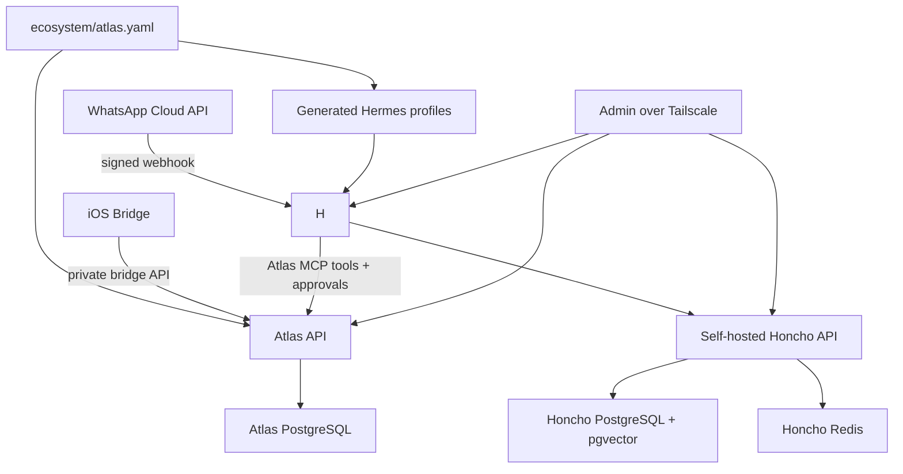

# Architecture

Project Atlas separates the ecosystem from the agent runtime. The ecosystem is installer-defined through `ecosystem/atlas.yaml`; there are no hard-coded household members or built-in personal agents.

Atlas owns:

- Persistent user and agent identities.
- Identity metadata and generated Hermes gateway allowlist values.
- Atlas custom capability catalog and generated Hermes skill files.
- Structured facts in PostgreSQL.
- Honcho workspace names in generated Hermes profile config.
- Atlas MCP tools for custom structured context.
- Approval workflows.
- Integration ingress and egress.
- Audit logs.

Hermes owns:

- The runtime conversation loop.
- Tool execution inside its configured sandbox.
- Agent profile behavior.
- Native skills and MCP tool discovery.
- Native memory-provider activation and Honcho memory access.

Honcho owns:

- Long-term memory inside isolated workspaces.

## Initial Topology

## Hermes Profile Topology

Atlas treats each configured agent as a Hermes profile. For example:

- `jose`: a personal Hermes profile with Jose's WhatsApp number in that profile's `.env` allowlist.
- `wife`: a personal Hermes profile with the spouse's WhatsApp number in that profile's `.env` allowlist.
- `family`: a shared Hermes profile with both numbers in that profile's `.env` allowlist and its own Honcho workspace.

The default deployment is one Hermes container supervising all profiles. This matches Hermes' native Docker profile model and keeps upgrades, logs, backups, and profile creation simpler. Use one container per profile only for hard isolation needs such as separate resource limits, network segmentation, image pinning, or compliance boundaries.

Profiles have separate memory by default because Atlas generates separate Honcho workspace names. If two profiles should intentionally view the same memory, set the same `honchoWorkspace` for those agents in `ecosystem/atlas.yaml`. If profiles should talk to each other, prefer Hermes-native profile/gateway/tooling patterns; Atlas should not proxy those conversations.

## WhatsApp Rules

- Allowed WhatsApp numbers are defined in `ecosystem/atlas.yaml`.
- Atlas merges Hermes' `WHATSAPP_ALLOWED_USERS` and `WHATSAPP_CLOUD_ALLOWED_USERS` values into each profile's `.env` without overwriting Hermes-owned credentials.
- Hermes' WhatsApp gateway rejects unknown senders before the agent loop.
- Atlas still stores identity records for bridge scoping, structured facts, approvals, and audit trails.

## Structured Data Versus Memory

PostgreSQL is the source of truth for facts:

- Identity records
- Health summaries
- Nutrition intake summaries
- Training plans, planned workouts, performed workouts, exercises, and sets
- Calendar busy blocks
- Reminders
- Goals
- Approvals
- Audit logs

Honcho is the memory layer for conversational and preference memory. Atlas generates Hermes profile-local `honcho.json` files with the intended workspace ids, and Hermes uses its native Honcho memory provider to read and write memory. Atlas does not merge workspaces automatically.

## Native Skills And Custom Capabilities

Hermes owns the native skill system. Atlas capability ids are configured per agent in `ecosystem/atlas.yaml`; Atlas validates those ids, stores them as deterministic metadata, and generates a profile-local Hermes skill at `skills/atlas-context/SKILL.md`.

Atlas custom data is exposed to Hermes through the generated `mcp_servers.atlas` config and the `atlas_get_context` MCP tool. Hermes remains the reasoning runtime; Atlas provides scoped facts, bridge context, generated memory-provider config, and approval records. WhatsApp identity is enforced by Hermes gateway allowlists; bridge data scoping and approvals remain enforced by Atlas API and the iOS bridge.
