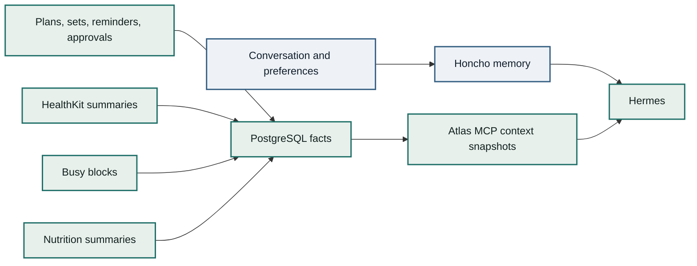

# Data Model

Atlas uses PostgreSQL for deterministic facts and Honcho for runtime memory. The split keeps facts queryable, retry-safe, and auditable while leaving conversational learning to Hermes and Honcho.

## Fact Groups

| Group | Tables |
| --- | --- |
| Identity | `users`, `agents`, `agent_memberships`, `identity_channels`, `bridge_devices` |
| Health | `health_daily_summaries` |
| Nutrition | `nutrition_daily_summaries`, `nutrition_meal_entries` |
| Training | `training_plans`, `planned_workouts`, `performed_workouts`, exercise and set tables |
| Calendar | `calendar_busy_blocks`, `calendar_events` |
| Location | `location_signals` |
| Coordination | `goals`, `reminders`, `approvals`, `shared_memory_grants`, `audit_logs` |

## Structured Facts Versus Memory

Use PostgreSQL when a fact needs identity scoping, idempotency, auditability, or deterministic queries. Use Honcho for natural-language memory that Hermes learns through normal runtime behavior.

## Training

Training data is deterministic:

- Plans and planned workouts can come from chat-confirmed plans, manual app entry, iOS, or imports.
- Performed workout summaries can come from HealthKit.
- Set-level details should come from local entry, a tracker import, or explicit user confirmation.
- Use stable `externalId` values so retries upsert the workout and replace child exercises/sets.

## Nutrition

Nutrition is intentionally lightweight:

- Daily calories, macros, fiber, hydration, meal count, confidence.
- Optional meal entries when useful.
- Source confidence tells Hermes how strongly to rely on the data.
- Atlas does not run a full food database service in v1.

## Calendar And Location

Calendar defaults to busy blocks. Event titles, notes, invitees, and locations require explicit sharing.

Location is semantic: `home`, `work`, `gym`, `school`, or `unknown`. Atlas should not store raw GPS history for this version.
