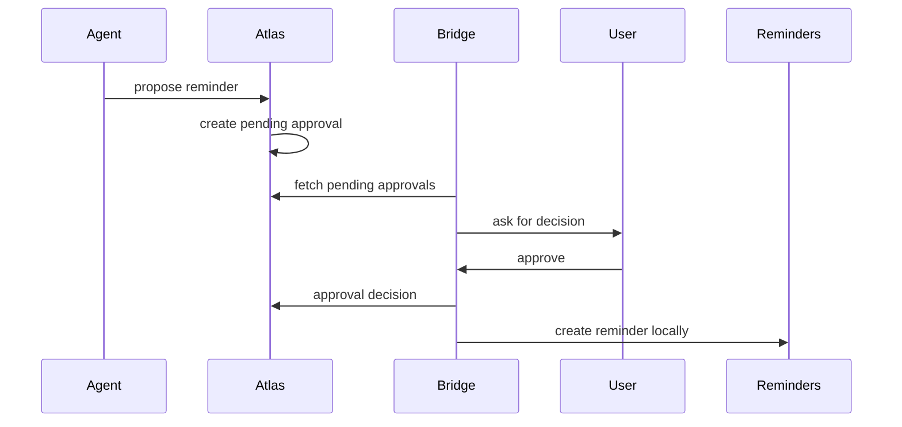

# iOS Bridge

Atlas Bridge is the custom capability layer for Apple-only data and local device actions. It is not an agent runtime. Hermes reaches bridge-derived context through Atlas' MCP tools when the generated `atlas-context` skill is relevant.

## HealthKit

The bridge reads HealthKit locally and sends daily summaries:

- Steps
- Workouts
- Active energy
- Exercise minutes
- Stand minutes
- Sleep minutes
- Weight

The watch and phone both write through HealthKit. The bridge should prefer HealthKit aggregate queries over per-device guesses, while preserving a coarse source value: `iphone`, `apple_watch`, `mixed`, or `manual`.

HealthKit permissions must be requested per data type. Keep the bridge implementation aligned with the user's explicit authorization choices and do not infer consent from other granted data types.

## Training

Performed workout summaries can be synced from HealthKit into `performed_workouts` using a stable `externalId`, such as the local HealthKit workout identifier available to the app. Atlas stores workout type, start/end, duration, energy, distance, heart-rate summaries, source device, and optional exercise/set detail.

Planned workouts and set prescriptions are deterministic Atlas facts, not memory. They can be created from chat-confirmed agent plans, manual iOS entry, or imports. When a performed workout links to a planned workout, Atlas marks the planned workout completed.

Set-level data should be sent only when the user entered it, imported it, or confirmed an agent-created plan. Do not infer exact sets and reps from a generic HealthKit workout summary.

## Calendar

Default sync sends only availability:

```json
{
  "userId": "jose",
  "windowStart": "2026-06-16T00:00:00.000Z",
  "windowEnd": "2026-06-23T00:00:00.000Z",
  "blocks": [
    {
      "startsAt": "2026-06-16T17:00:00.000Z",
      "endsAt": "2026-06-16T18:00:00.000Z",
      "availabilityType": "busy",
      "sourceCalendarHash": "calendar-hash"
    }
  ]
}
```

Event titles, notes, locations, and invitees are not shared by default.

## Location

The app should classify location locally into semantic signals:

- `gym`
- `home`
- `work`
- `school`
- `unknown`

Atlas stores semantic signals only. It should not store raw GPS history for this version.

## Reminders And Approvals

Atlas can propose reminders. The bridge should create them in Apple Reminders only after an approval is accepted by the target user.

Approval flow:



## Device Pairing

Initial setup uses the bootstrap bridge token from `.env` to register a device:

```http
POST /bridge/v1/devices/register
Authorization: Bearer <ATLAS_BRIDGE_API_KEY>
```

The response includes a `deviceId` and a raw device token. Store the token in the iOS Keychain. After pairing, bridge requests use:

```http
Authorization: Bearer <device-token>
X-Atlas-Device-Id: <device-id>
```

The server restricts device tokens to the paired `userId`.
