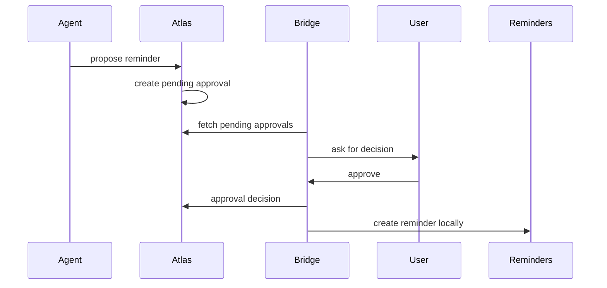

# iOS Bridge

Atlas Bridge is the capability layer for Apple-only data and local device actions. It is not an agent runtime.

## HealthKit

The bridge reads HealthKit locally and sends daily summaries:

- Steps
- Workouts
- Active energy
- Exercise minutes
- Stand minutes
- Sleep minutes
- Weight

The watch and phone both write through HealthKit. The bridge should prefer HealthKit aggregate queries over per-device guesses, while preserving a coarse source value: `iphone`, `apple_watch`, `mixed`, or `manual`.

## Calendar

Default sync sends only availability:

```json
{
  "userId": "jose",
  "windowStart": "2026-06-16T00:00:00.000Z",
  "windowEnd": "2026-06-23T00:00:00.000Z",
  "blocks": [
    {
      "startsAt": "2026-06-16T17:00:00.000Z",
      "endsAt": "2026-06-16T18:00:00.000Z",
      "availabilityType": "busy",
      "sourceCalendarHash": "calendar-hash"
    }
  ]
}
```

Event titles, notes, locations, and invitees are not shared by default.

## Location

The app should classify location locally into semantic signals:

- `gym`
- `home`
- `work`
- `school`
- `unknown`

Atlas stores semantic signals only. It should not store raw GPS history for this version.

## Reminders And Approvals

Atlas can propose reminders. The bridge should create them in Apple Reminders only after an approval is accepted by the target user.

Approval flow:


