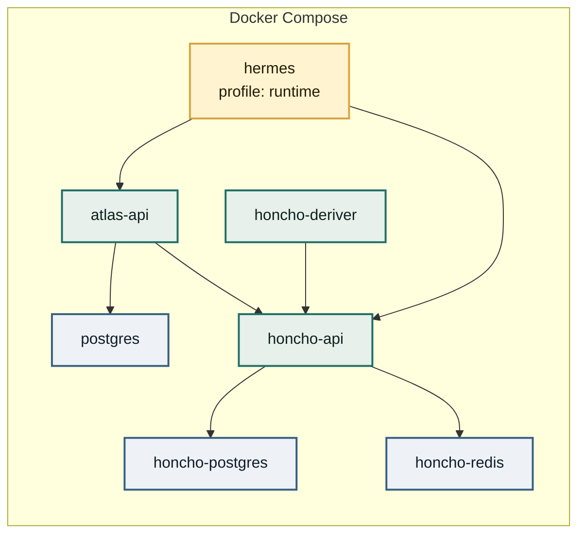

# Operations

Use the `atlas` CLI for day-to-day work. It wraps the repository scripts and Docker Compose commands so a VPS install does not require remembering individual script paths.

## Common Commands

| Command | Use |
| --- | --- |
| `atlas status` | Show Compose status and API health. |
| `atlas doctor` | Check Git, Docker, Tailscale, config, services, and API readiness. |
| `atlas configure` | Edit `.env` and `ecosystem/atlas.yaml`. |
| `atlas apply` | Rerun migrations, seed identities, regenerate Atlas-managed Hermes files, restart Atlas API. |
| `atlas runtime` | Generate Hermes profiles and start the Hermes runtime service. |
| `atlas webhook` | Publish Hermes' WhatsApp Cloud webhook through Tailscale Funnel. |
| `atlas logs atlas-api` | Tail Atlas API logs. |
| `atlas update` | Fast-forward the repo and rerun install. |

## Service Topology



`atlas-api`, Honcho, and PostgreSQL are base services. Hermes starts with the `runtime` Compose profile.

## Idempotency

The installer and apply path are designed for reruns:

- `.env` is created only when missing.
- Placeholder local secrets rotate only while they still contain placeholder values.
- Tailscale setup is skipped when the node is already connected.
- Honcho source is cloned only when missing unless `HONCHO_AUTO_UPDATE=true`.
- Database migrations run once through `schema_migrations`.
- Seeding converges memberships and identity metadata to `ecosystem/atlas.yaml`.
- Profile generation merges Atlas-managed Hermes settings while preserving Hermes-owned credentials, sessions, `SOUL.md`, and other profile state.
- Runtime generation writes `data/hermes/compose.runtime.yaml`; `atlas runtime` uses it to start the configured Hermes runtime groups.

## Tailscale And Webhook Edge

Administrative access should happen over Tailscale SSH. WhatsApp Cloud needs a public HTTPS callback, but only the Hermes webhook path should be public:

```text
https://<node>.<tailnet>.ts.net/whatsapp/webhook
```

`atlas webhook` proxies that path to Hermes' host-local Cloud API listener.

## Backups

Back up:

- PostgreSQL volume `postgres-data`.
- Honcho volumes `honcho-postgres-data` and `honcho-redis-data`.
- Hermes data directory `data/hermes/`.
- `.env` secrets in an encrypted password manager or backup.

## Documentation Publishing

The documentation site is static and lives in `docs/`. GitHub Pages publishes it through `.github/workflows/pages.yml`.

Repository setting required once:

```text
Settings -> Pages -> Build and deployment -> Source -> GitHub Actions
```

Local preview:

```bash
npm run docs:serve
```

Then open `http://127.0.0.1:8080`.
